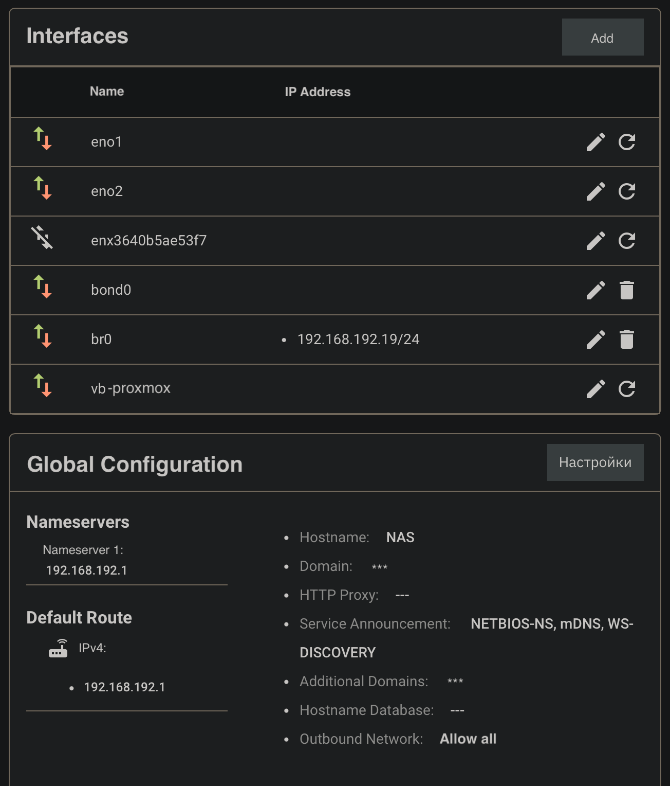
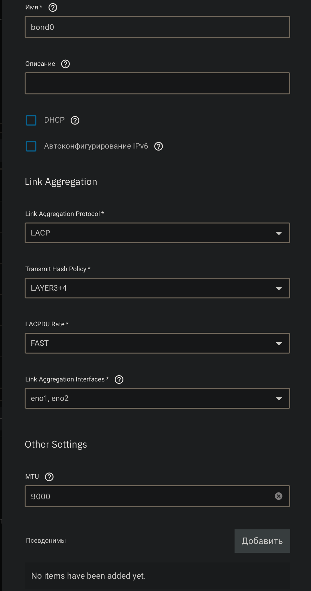
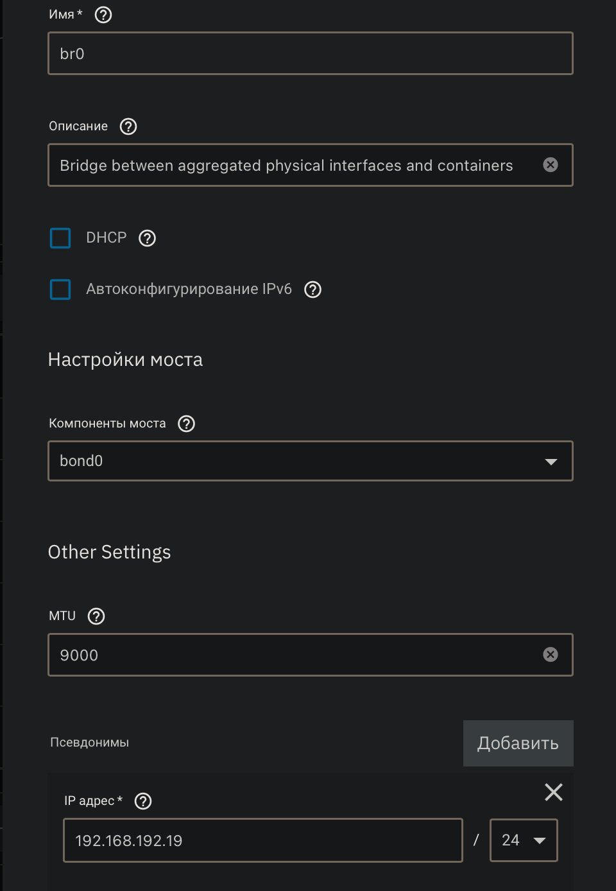
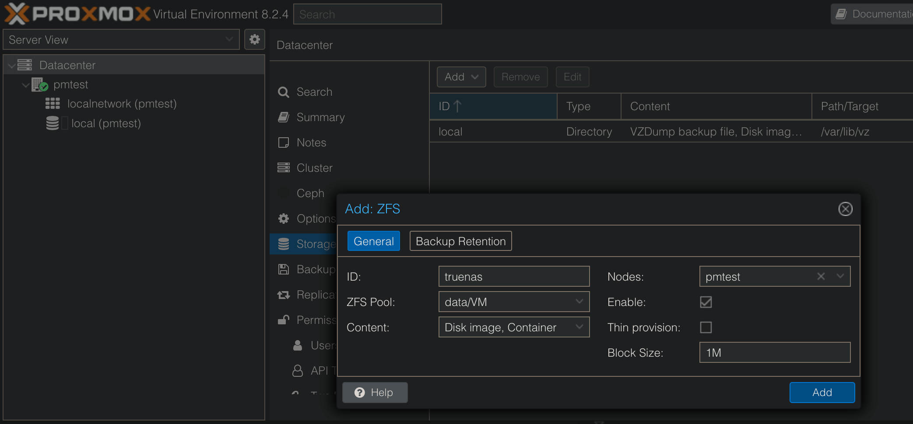

# Running Proxmox in a TrueNAS nspawn container

Thanks to [@Jip-Hop](https://github.com/Jip-Hop) and his [jailmaker](https://github.com/Jip-Hop/jailmaker) it
became possible to run _nspawn_ containers in an easy way. This repository
contains instructions and scripts to install Proxmox.

## Step 1. Network setup

Before you start with the container creation, make sure that you have a network
bridge working. We assume it is named `br0`, if not update the name in the
`config` file.

### Common rules:

- If you want bridges connected to VLANs you need to set up VLANs first (no ip)
  then create bridge for every VLAN that has a VLAN as a member.
- Do not add multiple VLANs to a single bridge as this will potentially create a
  loop and/or facilitate VLAN hopping.
- Once you have a bridge per VLAN you can add them to VMs as interfaces.
- Only add IP for this type of VLAN bridge if you want the TrueNAS machine to be
  present in given VLAN.
- You don't have to add ip for bridges for VMs to be able to use them.

### Steps to create a bridge:

1. Set up your main interface with static IP by disabling DHCP and adding IP alias (use the same IP you are connected to for easy results)
2. Test Changes and then Save them (important)
3. Edit your main interface, remove the alias IP
4. Don't click Test Changes
5. Add a bridge, name it something like br0, select your main interface as a member and add the IP alias that you had on main interface
6. Click Apply and then Test Changes
7. It will take longer to apply than just setting static IP, you can even get a screen telling you that your NAS in offline but just wait - worst case scenario TrueNas will revert to old network settings.
8. After 30sec you should see an option to save changes.
9. After you save them you should see both your main interface and new bridge active but bridge should have the IP

### Example:





## Step 2. Create Proxmox container

### Clone the repository

```
cd ~
git clone https://github.com/priezz/truenas-proxmox
cd truenas-proxmox
```

**Note:** `jlmkr` command should be available. See the [instructions](https://github.com/Jip-Hop/jailmaker) for more details.

### Create a new container

```
sudo ./create.sh -n <hostname> -i <containerip> -j "$(which jlmkr)"
```

#### Options:

```
  -n, --hostname <hostname>       The hostname of the container
  -i, --ip <containerip> The container IP address
  -j, --jlmkr "$(which jlmkr)"    The 'jlmkr' alias value
  -m, --mtu <mtu>                 The MTU value (1500 or 9000)

  -h, --help                      Display this help message
```

### Example:

```
sudo ./create.sh -n proxmox -i 192.168.1.10 -g 192.168.1.1 -m 1500 -j "$(which jlmkr)"
```

To ensure that the container is running do `jlmkr list`.

You should see your Proxmox web interface at `https://$CONTAINER_IP:8006` in a
few minutes (it takes time for all services to start).

### Step 3. Attach storage

1. Create a new dataset in TrueNAS (`VM` in this example)
2. Login to Proxmox web UI and go to `Datacenter` -> `Storage`
3. Add a new ZFS storage:

   a. Click `Add` -> `ZFS`
   b. Fill in the form:

   - ID: `vm`
   - ZFS Pool: `data_pool/VM`
   - Content: `Disk image, Container`
   - Nodes: `proxmox` (or the hostname you've chosen)
   - Block Size: `1M`

   c. Click `Add`

4. Update `local` storage settings to avoid using it for VMs:

   a. Click `local` -> `Edit`
   b. Uncheck `Disk image` and `Container`
   c. Click `OK`



## Known issues

- _"Failed to get shell PTY"_ error. This could be a reason why it is not
  possible to see logs and run commands with `exec` or `shell`.
- Proxmox TTY1 output is mixed with the TrueNAS TTY1 output. It not jut looks
  messy but also sometimes creates a fight for the login prompt.
